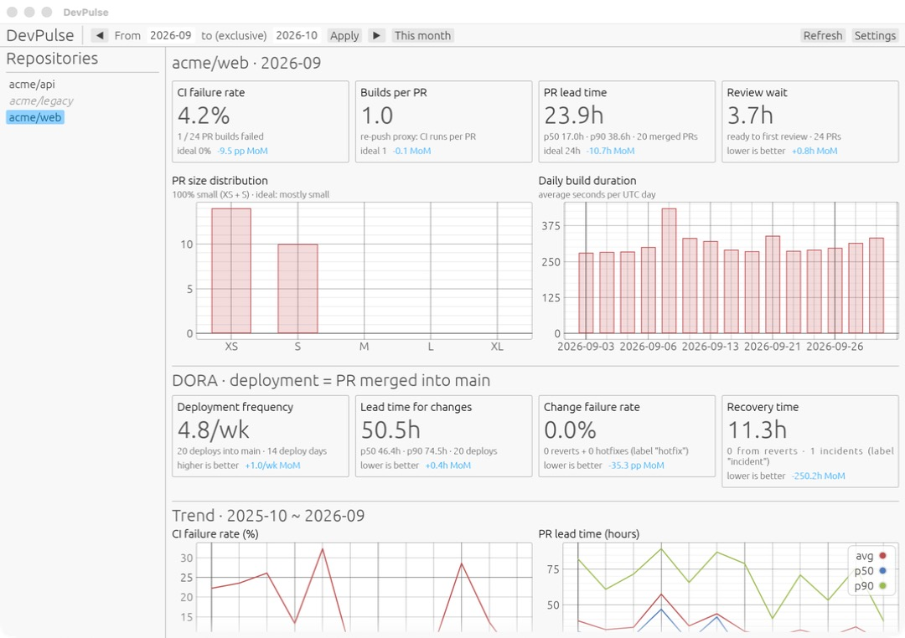

# DevPulse 桌面 dashboard

以 Rust 和 [egui](https://github.com/emilk/egui) 寫成的原生 dashboard，用來檢視 DevPulse 蒐集的指標。它是 `devpulse serve` 所提供 JSON API 的唯讀 client：資料蒐集（GitHub、CI provider、資料庫）全部由 Go 服務負責，這個 app 只需要 server URL 和 API token。

> English: [README.md](README.md)



針對每個 repo 和月份範圍，畫面會顯示：

- **KPI 卡片**，對應專案目標：CI 失敗率（理想值 0%）、每個 PR 的 build 次數作為 re-push 的替代指標（理想值 1）、PR 從建立到 merge 的 lead time（理想值 24h），以及 review 等待時間。選擇單一月份時，也會顯示和前一個月相比的變化。
- **PR 尺寸分布**（理想：多數為 XS / S）和**每日 build 時間**。
- **DORA 卡片**：部署頻率、變更前置時間、變更失敗率和恢復時間，附逐月變化。專案目標沒有訂 DORA 的目標值，所以卡片標示的是哪個方向比較好，而不是理想值。如果 server 還不知道 repo 的 default branch，面板會提示執行 `devpulse repo refresh`。
- **12 個月趨勢**：CI 失敗率、PR lead time（avg / p50 / p90）、每週部署次數和變更失敗率，終點為目前選擇的範圍。

## 編譯

Dashboard 是一個獨立的 Rust crate。編譯它不需要 Go，也不需要資料庫；這兩者只有在執行 `devpulse serve` 的機器上才需要。

### 1. 安裝 Rust

這個 crate 需要 Rust **1.95 以上**（見 `Cargo.toml` 的 `rust-version`）。用 [rustup](https://rustup.rs) 安裝：

```bash
curl --proto '=https' --tlsv1.2 -sSf https://sh.rustup.rs | sh
```

Windows 請改從 [rustup.rs](https://rustup.rs) 下載並執行 `rustup-init.exe`。如果已經裝過 Rust，先更新再確認版本：

```bash
rustup update stable
rustc --version
```

### 2. 安裝各平台的前置套件

| 平台 | 要安裝的東西 |
|---|---|
| macOS | Xcode Command Line Tools：`xcode-select --install` |
| Windows | [Visual Studio Build Tools](https://visualstudio.microsoft.com/visual-cpp-build-tools/)，勾選 **Desktop development with C++** 工作負載（rustup 預設的 `msvc` toolchain 需要它來連結） |
| Debian / Ubuntu | 下方的套件 |

```bash
sudo apt-get install build-essential pkg-config \
  libxcb-render0-dev libxcb-shape0-dev libxcb-xfixes0-dev libxkbcommon-dev
```

這份 Linux 套件清單來自 [eframe](https://github.com/emilk/egui/tree/main/crates/eframe) 的文件，但拿掉了 `libssl-dev`：這個 crate 的 HTTPS 用的是 rustls，keychain 走的是純 Rust 的 D-Bus client，所以不會連結 OpenSSL 或 libdbus。CI 在 `ubuntu-latest` 上就是只裝這些套件來編譯。其他發行版請安裝對應的 xcb 和 xkbcommon 開發套件。

### 3. 編譯

在 repository 根目錄執行：

```bash
cd desktop
cargo build --release --locked
```

有 `make` 的話，在 repository 根目錄執行 `make desktop` 效果相同。`--locked` 會使用已 commit 的 `Cargo.lock` 裡的相依套件版本，也就是 CI 測試過的版本。

第一次編譯會下載並編譯所有相依套件（在 Apple M 系列筆電上大約一分鐘），之後都是增量編譯。產出的是單一執行檔，旁邊不需要其他執行期檔案：

| 平台 | 執行檔 |
|---|---|
| macOS、Linux | `desktop/target/release/devpulse-desktop` |
| Windows | `desktop\target\release\devpulse-desktop.exe` |

執行檔可以複製到任何地方執行。目前還沒有安裝程式，也沒有 macOS 的 `.app` bundle，所以在 macOS 上要像一般的 binary 一樣從 terminal 啟動。

想快速編譯 debug 版並直接啟動，可以在 `desktop/` 執行 `cargo run`（或在 repository 根目錄執行 `make desktop-run`）。

## 執行

Dashboard 需要一個正在運作的 DevPulse API。在存放 DevPulse 資料庫的機器上執行（參考 [`serve`](../docs/commands.zh-TW.md#serve)）：

```bash
DEVPULSE_API_TOKEN=change-me devpulse serve
```

接著啟動 dashboard，開啟 **Settings**，輸入 server URL（預設 `http://127.0.0.1:8080`）和 API token，再按 **Save & connect**。**Test** 會同時確認 server 有在運作、token 也被接受。

### Server 在另一台機器上

`devpulse serve` 預設監聽 `127.0.0.1:8080`，其他機器連不到。請在 server 上改成監聽所有網路介面；這時一定要設定 token，否則 `serve` 會拒絕啟動：

```bash
HTTP_ADDR=0.0.0.0:8080 DEVPULSE_API_TOKEN=change-me devpulse serve
```

在 dashboard 裡填 server 的位址，例如 `http://192.168.1.10:8080`，並在 server 的防火牆開放 8080 port。API 走的是一般 HTTP，離開信任的網路時，請在前面放一個 TLS reverse proxy；或者讓 server 維持只監聽 loopback，改用 SSH tunnel 連線：

```bash
ssh -N -L 8080:127.0.0.1:8080 user@server   # 之後使用 http://127.0.0.1:8080
```

### 在同一台機器上完整試跑

如果這台機器也裝了 Go（參考[主 README](../README.zh-TW.md#安裝)），在 repository 根目錄執行：

```bash
make build
export DEVPULSE_DSN=sqlite://./devpulse.db GITHUB_TOKEN=<你的 token>
./bin/devpulse migrate up
./bin/devpulse repo add <owner/name>
./bin/devpulse repo sync <owner/name>
DEVPULSE_API_TOKEN=change-me ./bin/devpulse serve
```

然後在另一個 terminal 執行 `make desktop-run`，連到 `http://127.0.0.1:8080`，token 填 `change-me`。

### 疑難排解

| 狀況 | 處理方式 |
|---|---|
| Cargo 拒絕編譯，說這個 package 需要較新的 rustc | `rustup update stable` |
| Linux 上出現和 `xcb` 或 `xkbcommon` 有關的連結錯誤 | 安裝步驟 2 列出的套件 |
| Windows 上找不到 `link.exe` | 安裝步驟 2 的 Visual Studio Build Tools |
| 出現「Cannot read the keychain」或「Could not save the token」 | 沒有可用的系統 keychain，通常是 Linux 沒有執行 GNOME Keyring 或 KWallet。這時 token 只在當次執行有效；啟動時設定 `DEVPULSE_API_TOKEN` 就能略過 keychain |
| 出現「cannot reach server」 | 檢查 URL、`devpulse serve` 是否正在執行，以及 server 的 `HTTP_ADDR` 和防火牆 |
| 出現「API token was rejected (401)」 | token 和 server 的 `DEVPULSE_API_TOKEN` 不一致 |

## 設定存放位置

| 項目 | 位置 |
|---|---|
| API token | 作業系統的 keychain（macOS Keychain、Windows Credential Manager、Linux 的 Secret Service），每個 server URL 各存一筆 |
| Server URL、上次選擇的 repo | 作業系統設定目錄下的 `devpulse/desktop.json`：macOS 為 `~/Library/Application Support/`，Linux 為 `$XDG_CONFIG_HOME` 或 `~/.config/`，Windows 為 `%APPDATA%` |

GitHub 和 CI 的 token 不會傳到 dashboard，只留在 server 上。

以下環境變數用於腳本啟動和開發，只對當次執行有效，不會寫入設定檔或 keychain：

| 變數 | 效果 |
|---|---|
| `DEVPULSE_SERVER_URL` | 這次執行使用的 server URL |
| `DEVPULSE_API_TOKEN` | 這次執行使用的 API token（不讀取 keychain） |
| `DEVPULSE_DESKTOP_CONFIG` | 設定檔的路徑 |

## 開發

```bash
make desktop-test   # cargo test
make desktop-lint   # cargo fmt --check + clippy -D warnings
make desktop        # cargo build --release
```

測試會解析 Go API 在 [`internal/http/testdata/`](../internal/http/testdata/) 的 golden 檔案，所以 API 的 JSON 格式一旦改變，除了 Go 的測試，這裡的測試也會失敗。確定要改格式時，用 `go test ./internal/http/ -run Golden -update` 重新產生 golden 檔案，再更新 `src/api.rs` 裡的 Rust 型別。

| 檔案 | 用途 |
|---|---|
| `src/api.rs` | HTTP client 和 API 型別 |
| `src/state.rs` | Dashboard 狀態，以及 API 結果如何更新狀態 |
| `src/kpi.rs` | KPI 卡片的文字和逐月變化 |
| `src/month.rs` | `YYYY-MM` 的月份計算 |
| `src/settings.rs` | 設定檔和 keychain 存取 |
| `src/app.rs` | egui 畫面繪製；API 呼叫在 worker thread 執行 |
